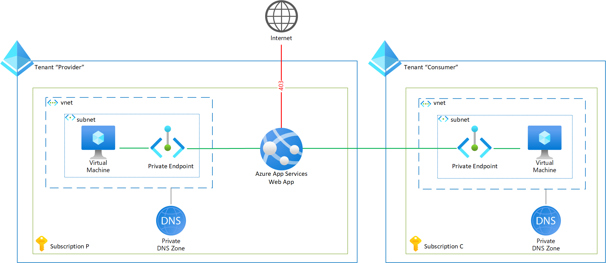

# Project Cross-Tenant Secure Access to Azure Web Apps and Azure Functions with Private Endpoints

The code in this repo creates the architecture as described in the article **TODO**.

## Architecture overview


In the overview above, the "Provider" Tenant on the left runs an Azure Web App that a client in the "Consumer" Tenant on the right wants to consume in a secure way via a Private Endpoint.


## Pre-requisites
You will need 2 distinct Azure Tenants: one for the "Provider" part and one for the "Consumer" part.

It is recommended to create a new resource group in each Tenant.

## Provider Tenant: 
  * Deploy via Bicep ``deploy/provider.bicep``
    * required parameters: the username and password for the Virtual Machine.
  * The Bicep will deploy
    * a Web App.
    * a Virtual Network with one Subnet and a Network Security Group allowing RDP access to the Virtual Machine.
    * a Virtual Machine in the Subnet to test the Private Endpoint connection the the Web App.
    * the Private DNS Zone linked to the Virtual Network.
    * a Private Endpoint for the Web App with a NIC in the Subnet and registered in the Private DNS Zone. It will automatically be approved and operational.

After deploying the Provider resource, you should be able to navigate to the Web App URL.
The Web App URL is returned as an output variable of the Bicep or you retrieve it via the portal.
* Via the public Internet, you will get a 403 Forbidden page.
* Via the deployed Virtual Machine, you will get the default Web App page.

_Warning: it is not recommended to expose the RDP management port 3386 on the Internet. For production environments, we recommend using a VPN or private connection._

## Consumer Tenant:
Next, to deploy the Consumer Tenant, get the deployed Web App Id from the Provider Tenant. It is available as output parameter of the Bicep or you can retrieve it via the portal.

  * Deploy via Bicep ``deploy/consumer.bicep``
    * required parameters: the username and password for the Virtual Machine; the Web App ID of the Provider's Web App.

  * The Bicep will deploy
    * a Virtual Network with one Subnet and a Network Security Group allowing RDP access to the Virtual Machine.
    * a Virtual Machine in the Subnet to test the Private Endpoint connection the the Web App.
    * the Private DNS Zone linked to the Virtual Network
    * a Private Endpoint for the Provider's Web App with a NIC in the Subnet and registered in the Private DNS Zone. The Provider connection state will be 'pending'.

_Warning: it is not recommended to expose the RDP management port 3386 on the Internet. For production environments, we recommend using a VPN or private connection._

## Manual Approval:

After deploying the Consumer Tenant, the Provider must approve the connection.
This can be done via the Azure Portal, or these AZ CLI commands (cf. ``manual-approval/approve-pending-connection.ps1``):

```powershell
#to be executed by the PROVIDER
#set the webAppId
$webAppId='THE PROVIDER WEB APP ID'

#get the private endpoint connections in pending state
az network private-endpoint-connection list --id $webAppId --query "[?properties.privateLinkServiceConnectionState.status=='Pending']"

#store the Id of the pending private endpoint connection to approve - adjust the index if more than one connection is pending.
$peId=az network private-endpoint-connection list --id $webAppId --query "[?properties.privateLinkServiceConnectionState.status=='Pending'].{id:id}[0]" --output tsv

#approve the private endpoint connection
az network private-endpoint-connection approve --description "Approved" --id $peId
```

## Clean-up
Delete the resource group in each Tenant.

## Contributing

This project welcomes contributions and suggestions.  Most contributions require you to agree to a
Contributor License Agreement (CLA) declaring that you have the right to, and actually do, grant us
the rights to use your contribution. For details, visit https://cla.opensource.microsoft.com.

When you submit a pull request, a CLA bot will automatically determine whether you need to provide
a CLA and decorate the PR appropriately (e.g., status check, comment). Simply follow the instructions
provided by the bot. You will only need to do this once across all repos using our CLA.

This project has adopted the [Microsoft Open Source Code of Conduct](https://opensource.microsoft.com/codeofconduct/).
For more information see the [Code of Conduct FAQ](https://opensource.microsoft.com/codeofconduct/faq/) or
contact [opencode@microsoft.com](mailto:opencode@microsoft.com) with any additional questions or comments.

## Trademarks

This project may contain trademarks or logos for projects, products, or services. Authorized use of Microsoft 
trademarks or logos is subject to and must follow 
[Microsoft's Trademark & Brand Guidelines](https://www.microsoft.com/en-us/legal/intellectualproperty/trademarks/usage/general).
Use of Microsoft trademarks or logos in modified versions of this project must not cause confusion or imply Microsoft sponsorship.
Any use of third-party trademarks or logos are subject to those third-party's policies.
